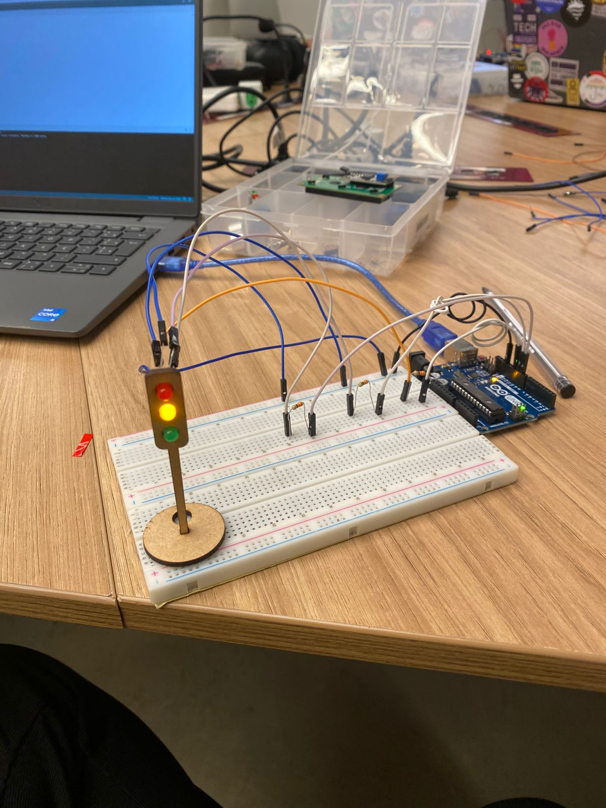

# Atividade - Semáforo offline

## 1. Descrição do Projeto
Esta atividade consiste na criação de um semáforo offline utilizando um **Arduino Uno**, LEDs e resistores conectados a protoboard. O sistema controla o acendimento de LEDs em três cores (vermelho, amarelo e verde) para simular o funcionamento de um semáforo, alternando entre as fases com tempos definidos utilizando millis.

---

## 2. Componentes Utilizados
Aqui estão os componentes utilizados para a realização da ponderada e suas especificações:

| Componente        | Quantidade |
|-------------------|------------|
| Arduino Uno       | 1          |
| LED Vermelho      | 1          |
| LED Amarelo       | 1          |
| LED Verde         | 1          |
| Protoboard        | 1          |
| Jumpers macho-fêmea | 6       |
| Jumpers macho-macho | 4       |
| Resistores        | 3          |

---

## 3. Montagem do Circuito
A montagem do circuito foi realizada na **protoboard** com os LEDs conectados nas seguintes portas do Arduino:
- **Porta 9:** LED Vermelho (fase de parada)
- **Porta 10:** LED Amarelo (fase de atenção)
- **Porta 11:** LED Verde (fase de passagem)

Observação: O código da atividade ponderada se encontra na pasta src
---

## 4. Visualização da atividade

Abaixo, uma imagem de demonstração do projeto funcionando, o link disponibilizado abaixo da figura leva para um video de demonstração

Desenvolvimento do Código 
 

Link: https://drive.google.com/drive/folders/13ZF8oOdB0MmfkLVQNljc8ScWujEs_F5H?usp=sharing

---
## 5. Avaliação do Circuito

Meu circuito foi avaliado pelo professor e também pelo meu colega de grupo André Lobo, de acordo com as avaliações de Andre, segue a tabela com os resultados avaliativos.

Avaliador: André Lobo
| Critério      | Contempla |  Contempla parcialmente | Não contempla | Observções do Avaliador |
|-------------------|------------|------------|------------|------------|
| Montagem física com cores corretas, boa disposição dos fios e uso adequado de resistores       | Até 3 pontos       | Até 1,5 pontos       | 0 pontos       | 3 pontos |
| Temporização adequada conforme tempos medidos com auxílio de algum instrumento externo     | Até 3 pontos       | Até 1,5 pontos       | 0 pontos       | 3 pontos |
| Código implementa corretamente as fases do semáforo e estrutura do código (variáveis representativas e comentários)      | Até 3 pontos       | Até 1,5 pontos       | 0 pontos       | 3 pontos |
| Ir além: Implementou um componente de extra, fez com millis() ao invés do delay() e/ou usou ponteiros no código      | Até 1 pontos      | Até 0,5 pontos       | 0 pontos       | 1 ponto |

Nota final: 10

Assim como ele realizou a avaliação do meu circuito, realizei a avaliação do circuito dele, segue a tabela da minha avaliação com base no projeto desenvolvido pelo Andre

Avaliador: Luiza Petenazzi
| Critério      | Contempla |  Contempla parcialmente | Não contempla | Observções do Avaliador |
|-------------------|------------|------------|------------|------------|
| Montagem física com cores corretas, boa disposição dos fios e uso adequado de resistores       | Até 3 pontos       | Até 1,5 pontos       | 0 pontos       | 3 pontos pois contempla corretamente |
| Temporização adequada conforme tempos medidos com auxílio de algum instrumento externo     | Até 3 pontos       | Até 1,5 pontos       | 0 pontos       | 3 pontos pois contempla corretamente |
| Código implementa corretamente as fases do semáforo e estrutura do código (variáveis representativas e comentários)      | Até 3 pontos       | Até 1,5 pontos       | 0 pontos       | 3 pontos pois contempla corretamente |
| Ir além: Implementou um componente de extra, fez com millis() ao invés do delay() e/ou usou ponteiros no código      | Até 1 pontos      | Até 0,5 pontos       | 0 pontos       | 1 ponto pois contempla corretamente |